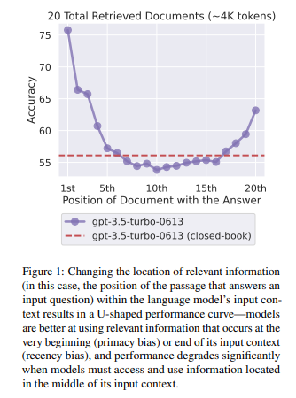

# Lost in Middle: How Language Model Use Long Contexts:

## Abstract
* 최근 LLM(Large Language Model) 모델들은 Long context(긴 지문들을)입력으로 처리할 수 있는 능력을 가지지만, 실제로 언어 모델이 이를 잘 인식하는지 혹은 잘 활용하는지 탐색을 하기 위해 발표된 논문.

* Mulit-Document(다중 문서)기반 QA(Question Answering)과 Key-Value 검색의 2가지 Task에 대해 진행.

* 실험결과
  * 정보(information)의 위치를 변경하면 선능이 크게 저하되는 점에서 현재(2023)의 LLM 모델들이 Long context를 잘 활용하지 못함.
  * 특히, 정보가 중간에 위치하는 경우에 이 현상이 크게 나타났으며, 위의 Task를 수행하기 위해 필요한 정보가 입력의 처음과 끝에 위치했을 때 가장 성능이 좋았음.

## Main
* 사용된 모델은 MPT-30B-Instruct(max token 8192, Pretrain으로 2048 token Sequecne로 1조 token 학습, 8192로 500억 token 학습), LongChat-13B(16K)(finetuning 16384 token sequence), OpenAI_GPT-3.5-Trubo(최대 4k, 16k 존재), Anthropic_Claude-1.3(최대 8k, 100k)존재

* 또한 위치를 변경하면서 실험을 진행하므로 Positional Encoding 계열 기법 사용(ALibi, Rotary Embedding)

* 출력 생성은 `Greedy Decoding`을 사용.
  * Text Generation 단계에서 다음 단어를 선택할 때 `가장 확률이 높은 단어`를 선택하는 방법으로 구현 난이도가 낮고 계산이 간단함(Beam Search나 top-k 방법에 비해).

### Experiments
* Mulit-Document(다중 문서)기반 QA(Question Answering)의 실험
  * Input Context에 포함되는 Documents의 개수를 조절하여 입력 문맥의 길이를 변화.
  * Relevant Document의 위치를 문맥의 시작, 중간 끝으로 변경시키면서 위치에 따른 영향을 측정함.
  * 실험 결과  
    
  * 실제로 U자형 곡선을 그리며 관련된 문서가 중간에 위치했을때는 오히려 관련된 문서를 제공하지 않은 것보다 성능이 더 좋지 않았음.

## ETC 
* 결국에 본 논문에서는 긴 문장(Long Context)가 입력으로 주어지면, 성능이 떨어진다는 점을 이용해서 `Reordering`을 통해 성능을 높이는 방법이 등장함.

* `Reordering`은 말그래도 순서를 다시 매기는 방법으로 만약, Rag system을 구축했을때, LLM에 전달되는 문서가 만약 20개라면 중요가 높은 문서는 최대한 입력의 앞과 끝으로 배치하는 기술이다.

* 해당 방법은 `Langchain`의 `LongContextReorder`를 사용하여 구현할수 있다
  * [관련 제세한 정보](https://python.langchain.com/docs/how_to/long_context_reorder/)

* 또한, 논문 저자들은 LLM의 활용을 더 극대화 및 후속 연구를 위해 사용된 평가 데이터와 코드를 공개했다.
  * [관련 링크](https://github.com/nelson-liu/lost-in-the-middle)